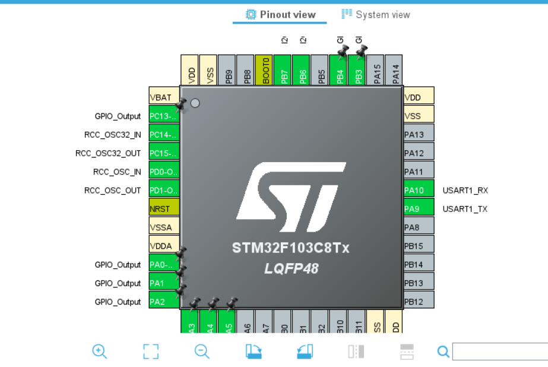
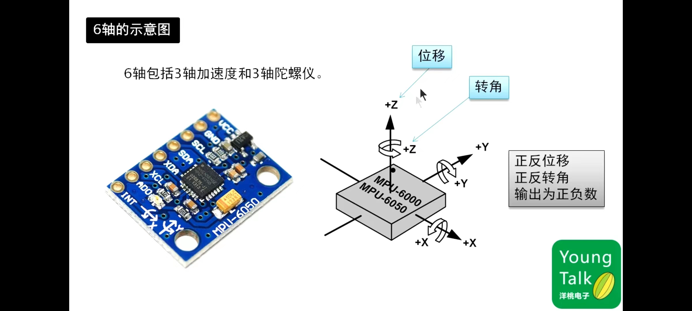
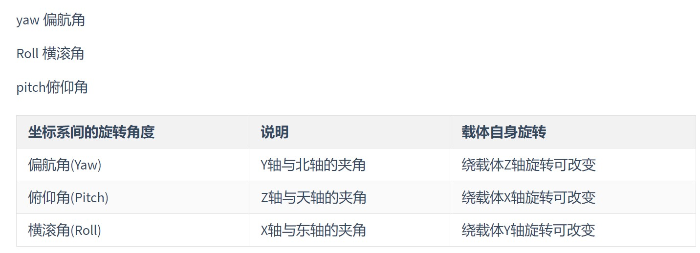
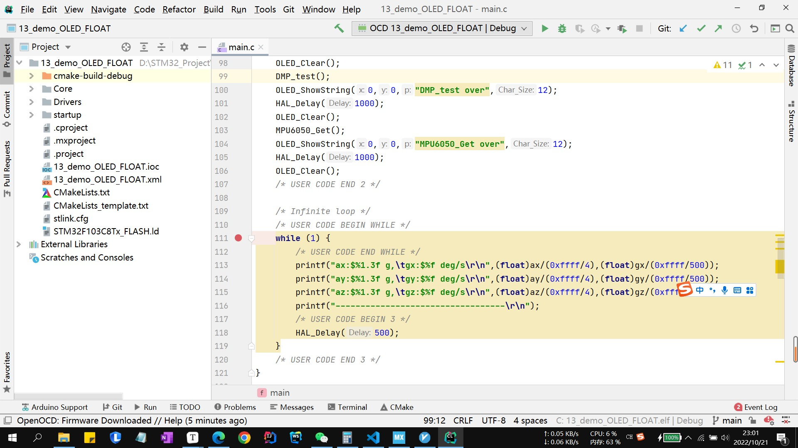

# stm32_clion_mpu6050_oled_dmp
stm32_clion_mpu6050_oled_dmp
一个关于 stm32 使用 clion 开发 实现 mpu6050 数据读取然后oled和串口显示的项目
>  使用一个硬件i2c控制mpu6050 
软件i2c控制oled 
mcu为 stm32f103c8t6 
oled为 128 * 64 0.96` oled 

